# IT Job Offers Analyzer

[](https://pypi.org/project/itjobs/)
[](https://pypi.org/project/itjobs/)
[](https://github.com/m-grzesiak/IT-job-offers-analyzer/blob/main/LICENSE)

Interactive CLI for analyzing IT job offers from [justjoin.it](https://justjoin.it) — salary stats, top companies, benefits, and more.



---

## Features

- **Salary analysis** — percentile distribution, median, IQR-based outlier detection
- **Top companies** — ranking by salary above configurable percentile threshold
- **B2B benefits** — paid vacation, sick leave, and extras extracted from offer descriptions
- **Salary progression** — compare junior through senior salary bands
- **Cross-group comparison** — compare by city, category, experience, employment type, or workplace
- **Recent offers** — browse newly published offers with per-day charts
- **Company drill-down** — view all offers for a company with vs-median deltas
- **Interactive REPL** — tab completion, session caching, ESC to cancel, auto-update check

## Installation

```bash
pip install itjobs
```

> Requires Python 3.10+.
> Dependencies ([rich](https://github.com/Textualize/rich), [prompt_toolkit](https://github.com/prompt-toolkit/python-prompt-toolkit))
> are installed automatically.

## Quick start

```bash
itjobs
```

Then type any command — data is fetched automatically:

```
/analyze Kraków python senior b2b     # salary stats
/top b2b >P75                         # companies above P75
/progression Kraków python b2b        # junior → senior
/compare Kraków Warszawa python b2b   # city vs city
/recent 7 Kraków python               # last 7 days
/benefits Kraków python senior        # B2B perks
```

## Commands

| Command                                                | Description                                             |
|--------------------------------------------------------|---------------------------------------------------------|
| `/analyze [city] [cat] [exp] [workplace] [type]`       | Salary analysis with percentile and distribution tables |
| `/top [city] [cat] [exp] [workplace] [type] [>P75]`    | Top companies by median salary (default: P90)           |
| `/outliers [city] [cat] [exp] [workplace] [type]`      | Offers outside the normal salary range                  |
| `/benefits [city] [cat] [exp] [workplace]`             | B2B benefits — vacation, sick leave, extras             |
| `/recent [days] [city] [cat] [exp] [workplace] [type]` | Recently published offers (default: 3 days)             |
| `/progression [city] [cat] [type] [workplace]`         | Salary progression across experience levels             |
| `/compare <values...> [filters...]`                    | Compare salaries across cities, categories, or types    |
| `/show <company>`                                      | All offers for a company with vs-median deltas          |
| `/companies`                                           | List companies in loaded data                           |
| `/status`                                              | Summary of loaded data and active filters               |
| `/clear`                                               | Clear screen and reset session                          |
| `/help`                                                | Full command reference with examples                    |
| `/quit`                                                | Exit                                                    |

### Parameters

| Parameter     | Allowed values                                                        |
|---------------|-----------------------------------------------------------------------|
| `[city]`      | Warszawa, Kraków, Wrocław, Gdańsk, Poznań, Łódź, Katowice, ...        |
| `[cat]`       | javascript, python, java, net, devops, data, go, mobile, testing, ... |
| `[exp]`       | junior, mid, senior, c_level                                          |
| `[workplace]` | remote, hybrid, office                                                |
| `[type]`      | b2b, permanent, mandate, internship                                   |
| `[>Pn]`       | Percentile threshold for `/top` — e.g. `>P75`, `>P90`                 |
| `[days]`      | Number of days for `/recent` — e.g. `7` (default: 3)                  |

All filter parameters are optional — omit them to search broadly. Parameters can appear in any order.

### `/compare` examples

```
/compare Kraków Warszawa python senior b2b       # compare 2 cities
/compare Kraków python java senior b2b            # compare categories
/compare Kraków python junior senior b2b          # compare experience
/compare Kraków python senior b2b permanent       # compare employment types
/compare Kraków python remote office b2b          # compare workplace types
```

Pass 2+ values from one dimension — the rest are filters.

## Development

```bash
git clone https://github.com/m-grzesiak/IT-job-offers-analyzer.git
cd IT-job-offers-analyzer
python -m venv .venv && source .venv/bin/activate
pip install -e .[test]
```

Run tests:

```bash
pytest
```

Build and publish:

```bash
pip install build twine
python -m build
twine upload dist/*
```

## How it works

1. **Data fetching** — pulls offers from the justjoin.it REST API with pagination. No external HTTP libraries — just
   `urllib`. Browser-like headers for compatibility.
2. **Salary normalization** — the API's salary unit field is unreliable, so `normalize_monthly()` uses value magnitude
   heuristics to detect hourly/daily/monthly/yearly rates and convert to monthly PLN.
3. **Analysis** — IQR-based outlier detection, percentile computation, and benefit keyword matching against HTML offer
   bodies.
4. **Caching** — offers are cached per session. Re-fetching only happens when filters change or detail loading is
   needed.

## Disclaimer

This project is intended for educational and personal use only. It is not affiliated with or endorsed by justjoin.it. No
scraped data is stored or redistributed — all analysis happens locally in your terminal session. Use responsibly and in
accordance with the target website's terms of service.

## License

[Apache License 2.0](LICENSE)
